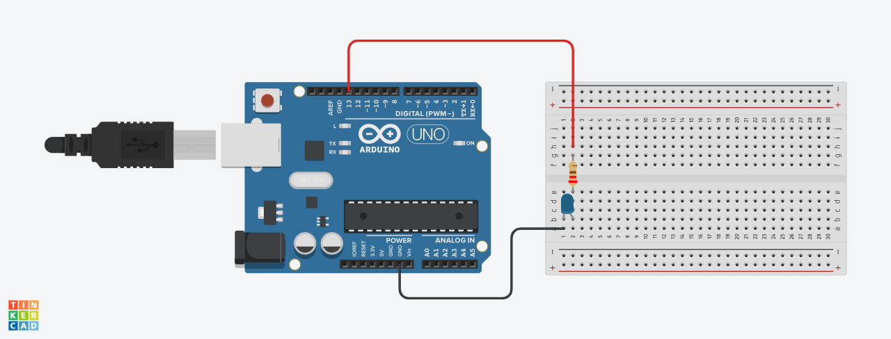

# Blink Led Interno

## Parte 1 – Blink LED Interno (Arduino)

&emsp; Este projeto realiza o “blink” do LED interno do Arduino, fazendo com que ele acenda por 1 segundo (1000 milissegundos), apague por 1 segundo (1000 milissegundos) e repita esse ciclo continuamente — criando o efeito de uma luz piscando.

---

### Funcionamento

O código faz o LED interno do Arduino:

- Acender por um tempo determinado (1000 milissegundos).

- Apagar e aguardar outro tempo (1000 milissegundos).

- Repetir o processo em loop infinito.

---

### Componentes utilizados

| **Componente**  | **Descrição**                                                                           |
| --------------- | --------------------------------------------------------------------------------------- |
| **Arduino UNO** | Placa principal utilizada para o controle do circuito e execução do código.             |
| **Cabo USB**    | Responsável pela alimentação e comunicação entre o Arduino e o computador.              |
| **LED**         | Componente emissor de luz utilizado para demonstrar o piscar.                           |
| **Arduino IDE** | Ambiente de desenvolvimento usado para escrever, compilar e enviar o código ao Arduino. |

---

### Código Utilizado
```c
// o setup funciona apenas uma vez ao ligar ou resetar a placa
void setup() { // declaração da função setup, tudo que estiver dentro de {} é executado uma vez no início
  pinMode(LED_BUILTIN, OUTPUT); // configura o pino do LED como saída
}

// a função loop é executado repetidamente enquanto a placa estiver ligada
void loop() { // declaração da função loop, tudo que estiver dentro de {} é executado em ciclo infinito
  digitalWrite(LED_BUILTIN, HIGH);  // envia tensão para o pino e faz o LED acender (estado lógico: HIGH)
  delay(1000);                      // pausa a execução por 1 segundo (1000 milissegundos) enquanto o LED permanece aceso
  digitalWrite(LED_BUILTIN, LOW);   // faz o LED desligar (estado lógico: LOW)
  delay(1000);                      // pausa a execução por 1 segundo (1000 milissegundos) enquanto o LED permanece apagado
} // fecha a função loop, a partir daqui o arduino volta e repete a função
```
---

### Evidências

<div align="center">
<figcaption><strong>Screenshot do código na Arduino IDE</strong></figcaption>
<br>

<br>
<em>Captura de tela mostrando o código desenvolvido na Arduino IDE, responsável por fazer o LED interno piscar em intervalos de 1 segundo.</em>
</div>

<br>

<div align="center">
<figcaption><strong>Foto do Arduino com LED aceso</strong></figcaption>
<br>

<br>
<em>Fotografia do Arduino conectado ao computador, com o LED interno aceso, comprovando o funcionamento do circuito e a execução correta do código.</em>
</div>

<br>

<div align="center">
<figcaption><strong>Vídeo demonstrando o LED piscando</strong></figcaption>
<br>
<br>

[Assista ao vídeo no Google Drive](https://drive.google.com/file/d/1QQKh9uTJVaOuTOY_MhBF_BXGAz6fiGJa/view?usp=sharing)

<em>Demonstração em vídeo do Arduino executando o código “Blink”, com o LED interno acendendo e apagando em intervalos regulares.</em>
</div>

---

# Parte 2 – Simulando Blink Externo (Arduino + Tinkercad)

&emsp; Esta parte do projeto tem como objetivo simular um circuito de pisca-pisca (Blink) utilizando o Arduino UNO no ambiente de simulação Tinkercad.
<br>
&emsp; A montagem contém um LED externo (off-board) conectado a um protoboard, resistor e jumpers.
<br>
&emsp; Ao iniciar a simulação no Tinkercad, o LED deve acender e apagar de forma contínua, seguindo os intervalos definidos no código.

## Funcionamento

&emsp; O código desenvolvido envia sinais elétricos através do pino digital 13 do Arduino, que é a porta padrão usada no exemplo clássico do “Blink”.
<br>
&emsp; Esse pino é configurado como saída (OUTPUT), permitindo o controle direto do LED conectado externamente.

### Etapas de funcionamento:

1. Define-se o pino do LED (porta 13, padrão para o exemplo de Blink) como saída.

2. O Arduino envia sinal HIGH (ligado) — o LED acende.

3. Aguarda o tempo definido (1000 milissegundos).

4. Envia sinal LOW (desligado) — o LED apaga.

5. Aguarda novamente (1000 milissegundos).

6. O processo se repete em loop infinito.

## Código Utilizado

```c
void setup()
{
  pinMode(LED_BUILTIN, OUTPUT);
}

void loop()
{
  digitalWrite(LED_BUILTIN, HIGH);
  delay(1000);
  digitalWrite(LED_BUILTIN, LOW);
  delay(1000);
}
```

## Componentes Utilizados

| **Componente**              | **Quantidade** | **Função**                                                                                       |
| --------------------------- | -------------- | ------------------------------------------------------------------------------------------------ |
| **Arduino UNO**             | 1              | Controlador principal do circuito                                                                |
| **Protoboard**              | 1              | Base para montagem dos componentes                                                               |
| **LED (off-board)**         | 1              | Indica visualmente o funcionamento do circuito                                                   |
| **Resistor (1000Ω)** | 1              | Limita a corrente elétrica que passa pelo LED                                                    |
| **Jumpers**                 | 2              | Fios de conexão: **vermelho** ligado ao pino 13 (saída padrão) e **preto** ligado ao GND (terra) |

## Ligações do Circuito

&emsp; O circuito foi montado utilizando o Arduino UNO e uma protoboard. O objetivo é fazer o LED externo piscar, controlado pela porta digital 13 do Arduino.

- O fio vermelho conecta o pino digital 13 do Arduino à perna positiva (ânodo) do LED, por meio de um resistor que limita a corrente elétrica e evita a queima do componente.

- O fio preto conecta o GND (terra) do Arduino à pena negativa (cátodo), fechando o circuito.

- O LED está posicionado na protoboard, com o ânodo (perna maior) ligado ao resistor e o cátodo (perna menor) conectado ao GND.

- O resistor está entre o pino 13 (via fio vermelho) e o LED, garantindo que a corrente seja adequada.

## Simulação no Tinkercad

Você pode acessar a simulação completa clicando no link abaixo:

[Projeto no Tinkercad – Blink Externo](https://www.tinkercad.com/things/72PKZNP9Jjp-brilliant-stantia-uusam/editel?returnTo=https%3A%2F%2Fwww.tinkercad.com%2Fdashboard&sharecode=0vpOIbYfVUXvAQsqPWNeLiUIDqDJZknN7xFXbFtlTxU)

## Evidências

<div align="center">
<figcaption><strong>Montagem no Tinkercad</strong></figcaption>
<br>

<br>
<em>Captura de tela mostrando o circuito montado com o Arduino, protoboard, resistor e LED.</em>
</div>

<br>

<div align="center">
<figcaption><strong>Código no Tinkercad</strong></figcaption>
<br>

<br>
<em>Screenshot do código desenvolvido no ambiente de simulação.</em>
</div>

<br>

<div align="center">
<figcaption><strong>Simulação em funcionamento</strong></figcaption>
<br>
<br>

[Assista ao vídeo no Google Drive]()

<em>Demonstração em vídeo mostrando o LED piscando alternadamente.</em>
</div>